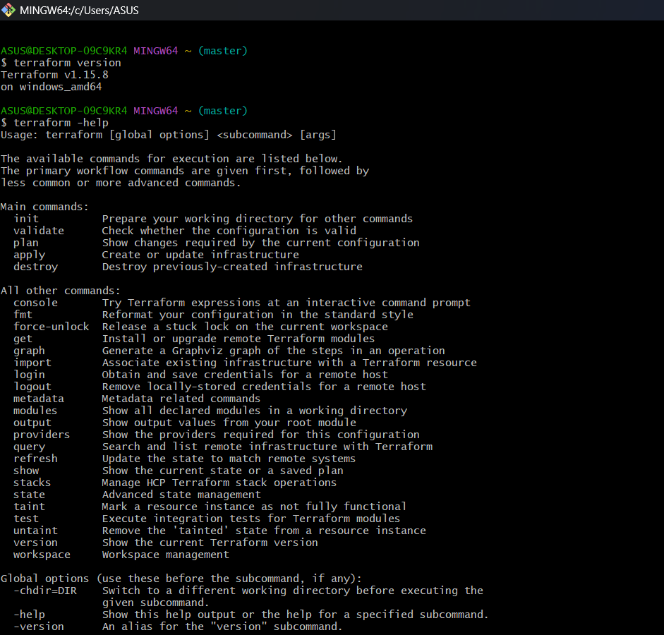
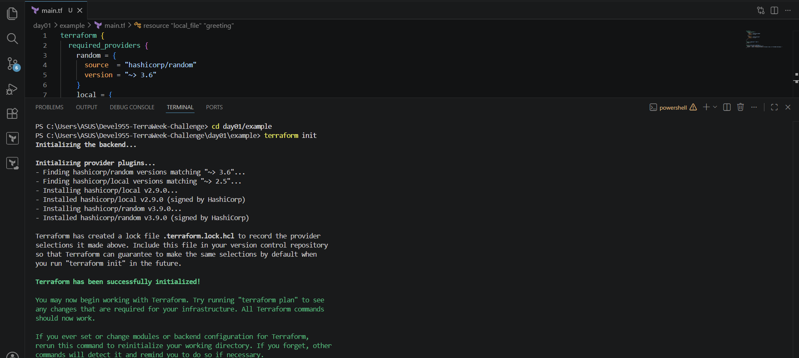
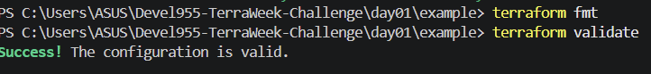
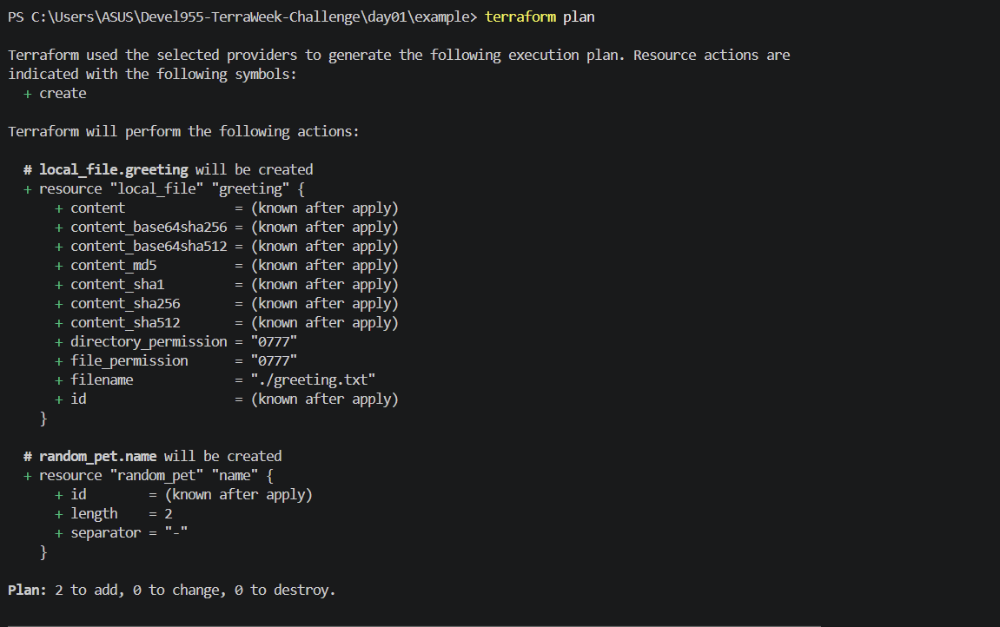
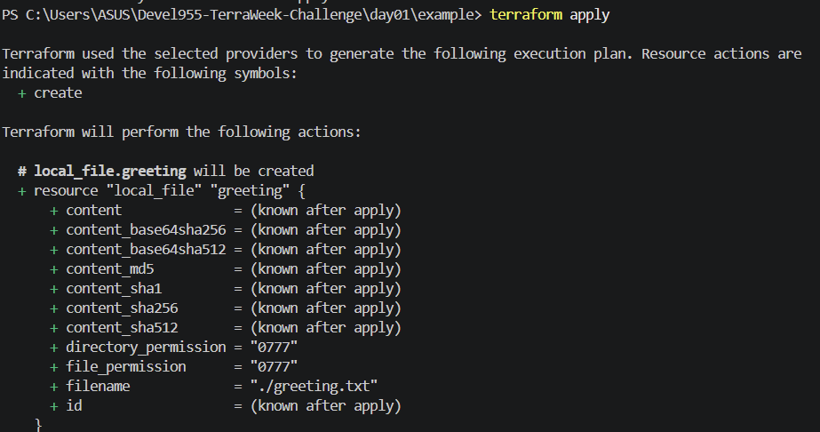
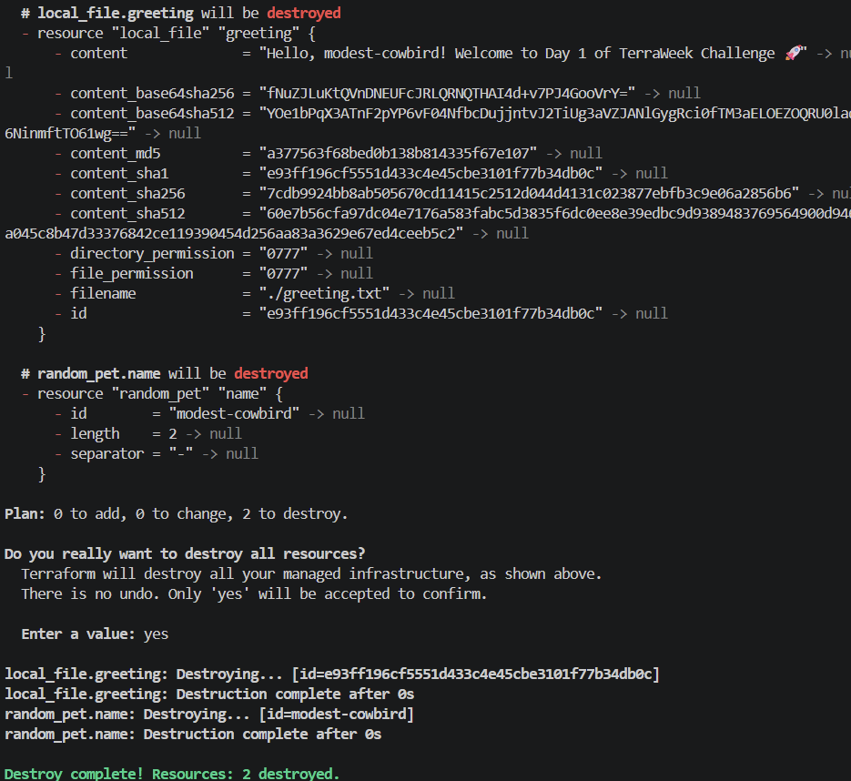

# Day 01 — Introduction to IaC & Terraform Basics

**Date:** 12 July 2026  
**Status:** Completed ✅

## Learning goals

- Understand Infrastructure as Code (IaC) and Terraform.
- Install Terraform and run the core workflow.
- Learn Terraform's core terminology.
- Provision and destroy a no-cost local resource.

## Task 1: IaC and Terraform

### What is Infrastructure as Code?

Infrastructure as Code means defining infrastructure in version-controlled configuration files instead of manually clicking through a cloud console. It makes changes repeatable, reviewable, auditable, and less prone to configuration drift.

### What is Terraform?

Terraform is HashiCorp's declarative Infrastructure as Code tool. You describe the desired end state in HCL, and Terraform determines the changes needed to reach it. Its provider ecosystem lets the same workflow manage AWS, Azure, GCP, Docker, GitHub, and many more platforms.

### Terraform compared with alternatives

| Tool | One-line comparison |
| --- | --- |
| **OpenTofu** | An open-source Terraform fork with near-compatible HCL workflows. |
| **Pulumi** | Defines infrastructure with general-purpose languages such as TypeScript, Python, Go, or C#. |
| **CloudFormation** | AWS-native IaC service, while Terraform is provider-agnostic. |
| **Ansible** | Focuses on configuration management and procedural automation; Terraform focuses on provisioning infrastructure declaratively. |

## Task 2: Terraform installation

Terraform was installed and verified with:

```bash
terraform version
terraform -help
```

The HashiCorp Terraform VS Code extension was also installed for HCL syntax highlighting, formatting, and autocomplete.

## Task 3: Six crucial Terraform terms

| Term | Meaning | Example |
| --- | --- | --- |
| **Provider** | A plugin that lets Terraform communicate with a platform or service. | `hashicorp/local` |
| **Resource** | An infrastructure object Terraform creates or manages. | `resource "local_file" "greeting" {}` |
| **State** | Terraform's record of managed resources and their current details. | `terraform.tfstate` |
| **Plan** | A preview of changes before they are applied. | `terraform plan` |
| **HCL** | HashiCorp Configuration Language, used for `.tf` files. | `resource "random_pet" "name" {}` |
| **Module** | A reusable package of Terraform configuration. | `module "network" { source = "./modules/network" }` |

## Task 4: First Terraform configuration

The [example](./example) directory uses the free `local` and `random` providers. It creates a `greeting.txt` file locally, so no cloud account or credentials are needed.

```bash
cd example
terraform init
terraform fmt
terraform validate
terraform plan
terraform apply
cat greeting.txt
terraform destroy
```

### Core Terraform workflow

```text
Write  →  Init  →  Plan  →  Apply  →  Destroy
 (.tf)    (setup)   (preview) (create)  (cleanup)
```

## Proof of completion

The screenshots below are the actual command captures stored in `day01/example/Screenshot/`.

### Terraform version


### Terraform init


### Terraform validate


### Terraform plan


### Terraform apply


### Generated greeting file


### Terraform destroy


## Bonus notes

- `terraform -install-autocomplete` configures command-line tab completion.
- OpenTofu is an open-source Terraform fork; its basic commands and HCL configuration are very similar.
- `.terraform.lock.hcl` records the selected provider versions and checksums so team members use the same verified provider builds. It should be committed.

## Key takeaway

Terraform makes infrastructure changes predictable: define the desired state, review the plan, apply the change, and destroy temporary resources when they are no longer needed.
