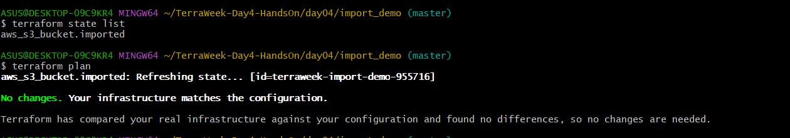

# TerraWeek Day 4 — State & Remote Backends

**Date:** Wednesday, 15 July 2026

Day 4 focused on Terraform state, remote backends, native S3 state locking, and importing existing infrastructure safely.

## What I learned

- Terraform state maps configuration to real infrastructure and must never be edited manually.
- State can contain sensitive values, so state files must not be committed to Git.
- An S3 remote backend makes team state storage more reliable than a local terraform.tfstate file.
- S3 native locking uses use_lockfile = true to prevent simultaneous state writes.
- Existing infrastructure can be brought under Terraform management with an import block.

## Hands-on completed

| Task | Result |
| --- | --- |
| Created a secure S3 state bucket | Versioning, AES256 encryption, and public-access blocking enabled |
| Migrated state to S3 | Used terraform init -migrate-state |
| Verified remote state | Confirmed terraform.tfstate in the S3 backend |
| Demonstrated native locking | Captured terraform.tfstate.tflock during apply |
| Imported an existing bucket | Used terraform plan -generate-config-out=generated.tf and terraform apply |

## Repository structure

```text
day04/
├── README.md
├── backend_infra/       # Creates the secure S3 state bucket
├── backend_demo/        # Local-to-S3 state migration and lock demonstration
├── import_demo/         # Import-block example
└── screenshots/         # Real command and AWS Console proof
```

## Safe backend configuration

Copy backend.tf.example to backend.tf, replace the placeholder bucket name with your own, and then run:

```bash
terraform init -migrate-state
terraform plan
```

> Do not commit terraform.tfstate, .terraform/, *.tfvars, or your real backend.tf.

## Proof screenshot

Real Terraform state and import verification:



## Cleanup

After documenting the exercise, destroy the demo resources and delete the temporary imported bucket and S3 backend bucket to avoid charges.

#TrainWithShubham #TerraWeekChallenge
