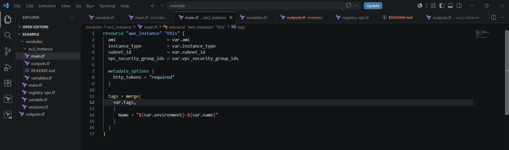
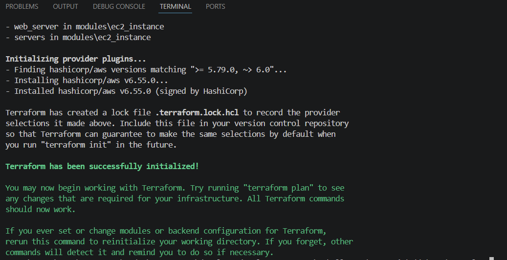
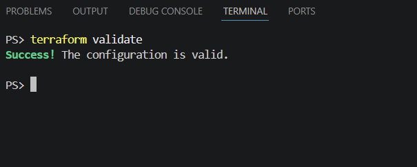
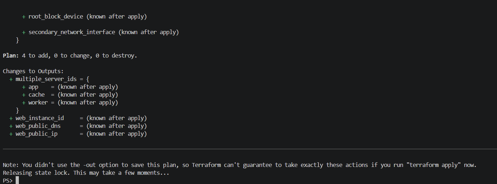
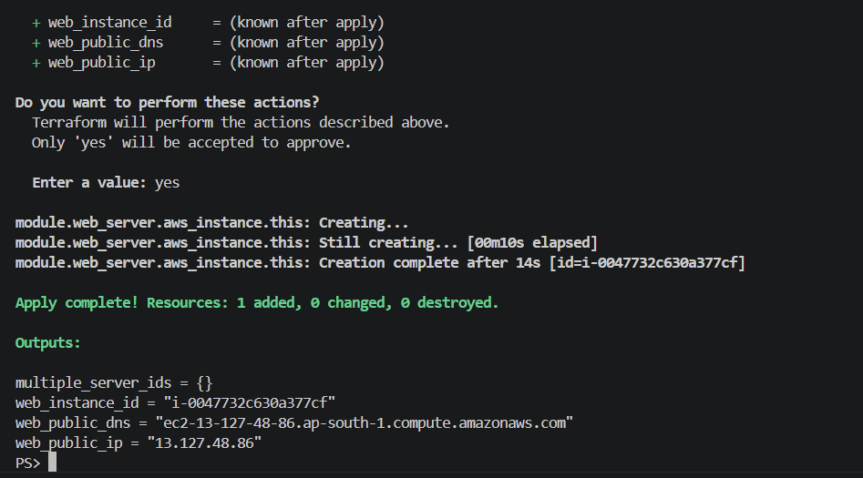
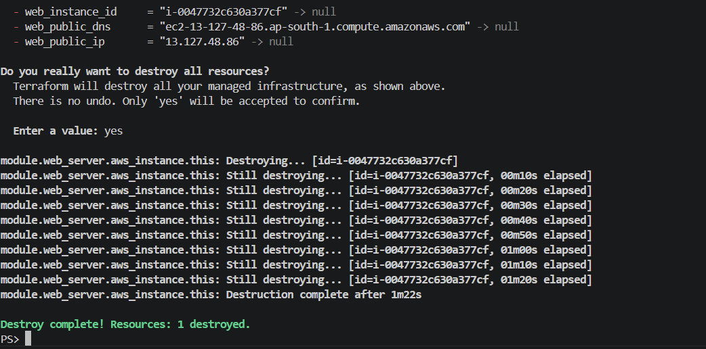

# TerraWeek Day 05 — Reusable Terraform Modules

This hands-on project demonstrates reusable and composable Terraform infrastructure with local modules, `for_each`, a Terraform Registry module, and version locking.

## Learning notes

A Terraform module is a collection of configuration files that work together to create infrastructure. The directory where Terraform commands are run is the **root module**; a module called from that configuration is a **child module**.

Modules improve reusability, consistency, encapsulation, versioning, and testing. A well-structured module commonly contains `main.tf`, `variables.tf`, `outputs.tf`, and `README.md`.

## Project structure

```text
day05/
├── README.md
└── example/
    ├── main.tf
    ├── variables.tf
    ├── outputs.tf
    ├── versions.tf
    ├── registry-vpc.tf
    └── modules/
        └── ec2_instance/
            ├── main.tf
            ├── variables.tf
            ├── outputs.tf
            └── README.md
```

## Local EC2 module

The root module resolves the AMI, subnet, and security-group IDs once, then passes them to the reusable `ec2_instance` child module. This keeps the child module independent and avoids duplicate data lookups.

```hcl
module "web_server" {
  source = "./modules/ec2_instance"

  name                   = "web"
  instance_type          = var.instance_type
  environment            = var.environment
  ami                    = data.aws_ami.al2023.id
  subnet_id              = local.subnet_id
  vpc_security_group_ids = local.security_group_ids
  tags                   = local.common_tags
}
```

## Multiple module instances with `for_each`

The same child module is used to preview `app`, `worker`, and `cache` instances without copy-pasting resource blocks.

```hcl
module "servers" {
  source   = "./modules/ec2_instance"
  for_each = var.create_multiple_servers ? var.server_names : toset([])

  name                   = each.key
  instance_type          = var.instance_type
  environment            = var.environment
  ami                    = data.aws_ami.al2023.id
  subnet_id              = local.subnet_id
  vpc_security_group_ids = local.security_group_ids
  tags                   = local.common_tags
}
```

## Registry module and version locking

The official AWS VPC module is included as a disabled-by-default reference example. Its version is pinned to avoid unexpected breaking changes.

```hcl
module "registry_vpc_example" {
  source  = "terraform-aws-modules/vpc/aws"
  version = "~> 5.0"

  count = var.enable_registry_vpc_example ? 1 : 0
}
```

`~> 5.0` permits compatible `5.x` releases but not `6.0`.

### Other ways to pin a module

```hcl
# Exact Registry version
version = "= 5.1.2"

# Git tag / branch reference
source = "git::https://github.com/org/repo.git//modules/ec2?ref=v1.2.0"

# Immutable Git commit SHA
source = "git::https://github.com/org/repo.git//modules/ec2?ref=0123456789abcdef0123456789abcdef01234567"
```

Version pinning creates reproducible infrastructure builds and prevents surprise upgrades.

## Commands used

```powershell
cd day05/example
terraform fmt -recursive
terraform init
terraform validate
terraform plan -var="create_multiple_servers=true"
terraform apply
terraform destroy
```

## Hands-on result

- Built a reusable EC2 child module with inputs, outputs, validation, and documentation.
- Called the module for a web server and read outputs from the root module.
- Used `for_each` to plan app, worker, and cache instances.
- Referenced the AWS VPC Registry module with a pinned version.
- Created one temporary EC2 instance for verification and safely destroyed it after the exercise.

## Proof screenshots

### Module and Terraform workflow







### Multiple instances and cleanup







The Registry VPC configuration is available in [`example/registry-vpc.tf`](example/registry-vpc.tf) and remains disabled by default.

## Cleanup

The temporary EC2 instance was destroyed successfully after verification. The default VPC has no billed compute resources.
