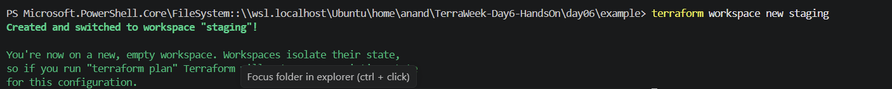
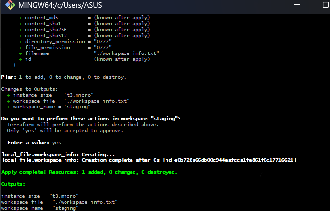
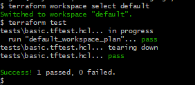
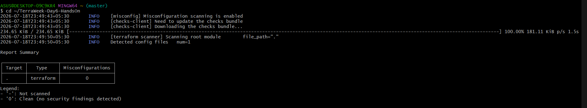
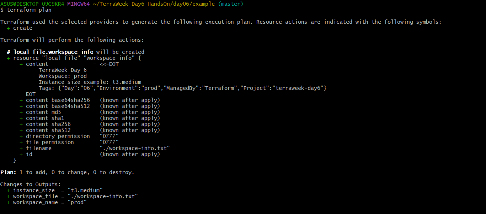
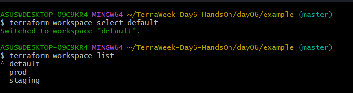
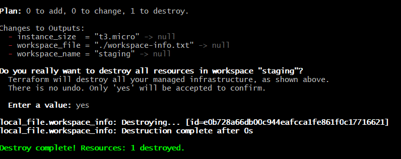

# TerraWeek Day 6 — Workspaces, Testing, Security & CI

This hands-on demonstrates a safe Terraform quality workflow without creating billable cloud resources. The configuration uses the `local` provider and changes its values according to the selected Terraform workspace.

## What I practised

- Terraform workspaces for isolated `default`, `staging`, and `prod` state.
- Workspace-aware expressions with `terraform.workspace`.
- Native Terraform tests using `.tftest.hcl` assertions.
- Static configuration scanning with Trivy.
- GitHub Actions quality gates for format, validation, testing, and security checks.

## Workspace behaviour

| Workspace | Instance size example |
| --- | --- |
| `default` | `t3.micro` |
| `staging` | `t3.micro` |
| `prod` | `t3.medium` |

Each workspace stores its Terraform state separately. The example writes a small `workspace-info.txt` file only for the active workspace.

## Repository structure

```text
day06/
├── example/
│   ├── main.tf
│   ├── outputs.tf
│   ├── versions.tf
│   └── tests/
│       └── basic.tftest.hcl
├── screenshots/
│   ├── 01-workspace-staging.png
│   ├── 02-staging-apply.png
│   ├── 03-terraform-test.png
│   ├── 04-trivy-security-scan.png
│   ├── 05-prod-plan.png
│   ├── 06-workspace-list.png
│   └── 07-cleanup.png
└── README.md
```

## Commands run

```bash
cd day06/example
terraform fmt -recursive
terraform init
terraform validate

terraform workspace new staging
terraform apply
terraform workspace select default
terraform test

terraform workspace new prod
terraform plan

trivy config --severity HIGH,CRITICAL ./day06/example

terraform workspace select staging
terraform destroy
terraform workspace select default
terraform workspace list
```

## Native test

The test in `example/tests/basic.tftest.hcl` verifies that the default workspace uses `t3.micro` and exposes the expected workspace output.

## CI quality gates

The workflow at `.github/workflows/terraform.yml` runs on pushes and pull requests:

1. `terraform fmt -check -recursive`
2. `terraform init -input=false`
3. `terraform validate`
4. `terraform test`
5. Trivy configuration scan for HIGH and CRITICAL findings

## Proof

### Staging workspace



### Apply in staging



### Terraform native test



### Trivy scan



### Production plan



### Workspace isolation



### Cleanup



## Notes

- This exercise uses a local file only; it does not create AWS resources or incur cloud charges.
- The staging resource was destroyed after verification.
- The `prod` workspace was planned only, not applied.
